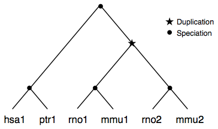

# Homology/FastOMA Use Case

We have developed this use case starting from the need to map FastOMA results, [reference paper][INTRO-10]. The main thing import in KnetMiner from this software is HOG Trees, that is, subtrees of HOGs, and not necessarily whole trees.

For us, a HOG Tree is a subtree of HOGs (or similarly, of paralogous groups), which in turn, is a group of orthology-related proteins. Proteins linked to HOGs are linked to the HOG tree, the tree node where they're linked is omitted (though you can report info such as depth).

The idea is providing a synthetic view of the tree, to avoid too large final KGs, too detailed user views and performance issues with graph traversals.

[INTRO-10]: https://journals.plos.org/plosone/article?id=10.1371

## Existing schemas and ontologies

**OrhoXML**

[OrthoXML][SART-05] is a format for orthology data, used by FastOMA.
The [OMA SPARQL][SART-07] endpoint is is useful to understand ORTH and related ontologies. See this [query example](omabrowser-ex.sparql).

[SART-05]: https://orthoxml.org
[SART-07]: https://sparql.omabrowser.org/lode/sparql

**ORTH**

[ORTH][SART-10] is the main ontology for orthology, which uses [CDAO][SART-20]. ORTH has "Hierarchical Gene Tree" (HGT), which represent a tree of genes as a whole.

a HGT `cdao:has` "Gene Tree Node" (GTN)

GTN has subclasses like "Cluster of Homologous Sequences", which has "Cluster of Orthologous" and Paralogous"

**BioLink**
The closest class in BioLink is [GeneFamily][SART-30], which is only superficially related, since it doesn't seem to support hierarchical relations.

**BioSchemas**
Nothing very relevant found. `schema:CreativeWork` seems to be the best one to subclass. To be noted that they have [SequenceAnnotation][SART-40] in draft, which looks like a mix of sequence and seq annotations, in fact, it subclasses `BioChemEntity`. Whatever, HOGTrees and HOGs are information entities (like iao:InformationContentEntity), they're not sequences, nor biochem entities. 

### Scoring properties

We have the following attributes from FastOMA. **WARNING**: the table was built through Gemini and not verified yet.

| Attribute | Suggested Ontology Mapping | URI / ID | Definition/Role |
| :--- | :--- | :--- | :--- |
| **METHOD** | `sio:is-about` | [SIO_000008](http://semanticscience.org) | The algorithm/logic used for the assignment (e.g., `RootHOG`). |
| **family_p** | `stato:p-value` | [STATO_0000067](http://purl.obolibrary.org) | Statistical significance (p-value) of the protein's match to the RootHOG. |
| **family_count** | `sio:count` | [SIO_000794](http://semanticscience.org) | Raw number of protein members in the ancestral RootHOG. |
| **family_normcount** | `sio:normalized-value` | [SIO_000210](http://semanticscience.org) | Family count adjusted for taxonomic diversity/species sampling. |
| **subfamily_score** | `stato:confidence-score` | [STATO_0000101](http://purl.obolibrary.org) | Confidence/certainty metric for the specific subfamily (sub-clade) assignment. |
| **subfamily_count** | `sio:count` | [SIO_000794](http://semanticscience.org) | Number of protein members within the specific taxonomic sub-clade. |
| **qseqlen** | `sio:sequence-length` | [SIO_001375](http://semanticscience.org) | Amino acid length of the query protein instance. |
| **subfamily_medianseqlen** | `sio:median` | [SIO_000121](http://semanticscience.org) | Median length of all members in the subfamily (useful for detecting fragments). |
| **qseq_overlap** | `sio:similarity-measure` | [SIO_000557](http://semanticscience.org) | Measure of sequence coverage/overlap between the query and the group. |

**Alternative proposals from GPT**

Again, this AI output isn't verified yet.

| Attribute Name           | Description                                                      | Candidate Ontology Terms (examples)                                   |
|--------------------------|------------------------------------------------------------------|-----------------------------------------------------------------------|
| METHOD                   | Method used for orthology inference (e.g., RootHOG)              | SIO:001042 (method), STATO:0000039 (statistical method)               |
| family_p                 | Family p-value or probability                                    | STATO:0000176 (p-value), SIO:001367 (probability)                     |
| family_count             | Number of genes/proteins in the family                           | SIO:000897 (count), ORTH:0000102 (orthologous group)                  |
| family_normcount         | Normalized count of family members                               | SIO:001367 (normalized value), STATO:0000255 (normalized count)       |
| subfamily_score          | Score assigned to the subfamily                                  | SIO:001388 (score), STATO:0000187 (score)                             |
| subfamily_count          | Number of genes/proteins in the subfamily                        | SIO:000897 (count), ORTH:0000103 (subfamily)                          |
| qseqlen                  | Length of the query sequence                                     | SIO:001043 (sequence length), BioSchemas:Protein (sequenceLength)     |
| subfamily_medianseqlen   | Median sequence length in the subfamily                          | SIO:001043 (sequence length), STATO:0000574 (median)                  |
| qseq_overlap             | Overlap length between query and subject sequences               | SIO:001043 (sequence length), SIO:001367 (overlap)                    |

[SART-10]: https://www.ebi.ac.uk/ols4/ontologies/orth
[SART-20]: https://www.ebi.ac.uk/ols4/ontologies/cdao
[SART-30]: https://biolink.github.io/biolink-model/GeneFamily/
[SART-40]: https://bioschemas.org/types/SequenceAnnotation/0.1-DRAFT-2019_06_21

## The model and examples

* We outlined a [sample RDF modelling here](orthology-fastoma-use-case.ttl)
* We also outlined a [translation to LPGs here](orthology-fastoma-use-case-cypher.md)

Both are based on example 4 from the [OMA Browser documentation][UC-10].

We report the same figure about that example here, for the record:

A copy of the original OrthoXML file is also available here: [orthoxml-ex-4.xml](orthoxml-ex-4.xml).

[UC-10]: https://orthoxml.org/0.4/orthoxml_doc_v0.4.html
