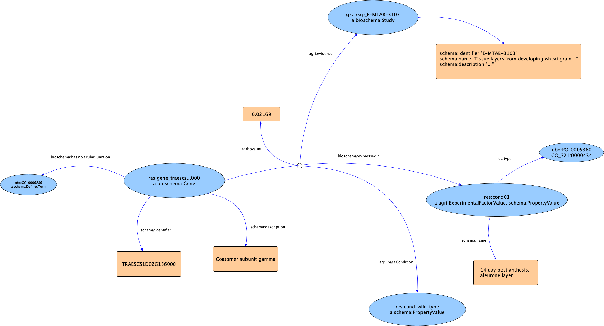

# Translating GXA data to agrischemas

The following diagram summarises the main modelling about mapping [EBI Gene Expression Atlas][https://www.ebi.ac.uk/gxa] data into AgriSchemas.

The GXA offers per-experiment summaries of the conditions under which genes are expressed, according to microarray or NGS experiments. The data is derived from ArrayExpress experiments, and the GXA curators re-analyse the raw data to provide normalised gene expression levels, differential expression analyses, etc.



In the follow, we show a walkthrough into details.


## Experiment, general description

This is similar to the [MIAPPE use case](../miappe-use-case/README.md).

```javascript
bkr:exp_E-MTAB-3103 a bioschema:Study;
	schema:identifier "E-MTAB-3103";
	dc:title "Tissue layers from developing wheat grain at 12 days post-anthesis";
	schema:description "Inner pericarp, outer pericarp and endosperm layers from...";
	schema:datePublished "2015-04-24";
	schema:subjectOf bkr:pmid_26044828;

	bioschema:studyProcess # What Bioschemas prescribes for study design
	[
		# schema:PropertyValue is redundant, See MIAPPE case
		#
		a agri:ExperimentalDesign, schema:PropertyValue;

		schema:name "study design"; # optional, useuful for applications understanding schema.org
		# See notes, this could be duped into schema:value
		schema:description "The experiment comprised the analysis of 484 Arabidopsis plants of the C24 genotype, with 384 reps that were placed in the LemnaTec carriers...";
		schema:propertyID ppeo:experimental_design; # optional as above, as per schema.org, this is the property type, not the value
		# dc:type is instead to add ontology terms of which this particular design is an instance
		dc:type <http://purl.obolibrary.org/obo/OBI_0500014>; # factorial design

		schema:additionalProperty
		[
			a schema:PropertyValue;
			schema:name "EBI ArrayExpress Technology Type";
			schema:value "transcription profiling by array";
			schema:propertyID "aeTechnologyType";
			dc:type efo:EFO_0002768; # transcription profiling by array

			# The alternative is: ID: "RNASeq", label: "RNA-seq of coding RNA", EFO_0003738
		],
		[
			# Very GXA specific property, has values 'Differential' or 'Baseline'
			a schema:PropertyValue;
			schema:name "EBI Gene Expression Atlas Analysis Type";
			schema:value "differential expression analysis data transformation";
			schema:propertyID "gxaAnalysisType";
			dc:type obo:OBI_0000650;

			# TODO: the alternative is Baseline and we're not sure which term should be used for that
			# maybe "sequence data feature count tabulation" (OBI_0002568)?
		],
	]; # /ExperimentalDesign	
.

# The organism specification
# If a more specific characterisation is missing (ie, you only have the organism associated to
# the experiment), the best class to use should be FieldTrialMaterialSource, so that the same
# source could be re-used for multiple experiments or other purposes.
# >>> It should be FieldTrialMaterial, if it needs to have some experiment-specific property.
# 
bkr:specie_triticum_aestivum a agri:FieldTrialMaterialSource, schema:BioChemEntity;
  
	# While agri:FieldTrialMaterialSource is already a subclass of ppeo:material_source,
	# you might want to add this redundancy, for the sake of more interoperability.
	# Basically, this is static the role of the BioChementity
	schema:additionalType ppeo:material_source;
	
	schema:name "Triticum aestivum";
	schema:subjectOf bkr:exp_E-MTAB-4484;
	bioschema:taxonomicRange <http://purl.bioontology.org/ontology/NCBITAXON/4565>;
	dc:type <http://purl.bioontology.org/ontology/NCBITAXON/4565>;
.

bkr:pmid_26044828 a agri:ScholarlyPublication;
	dc:title "Heterologous expression and transcript analysis of gibberellin biosynthetic genes..."
	agri:pmedId "26044828";
	agri:authorsList "Pearce S, Huttly AK, Prosser IM, Li YD, Vaughan SP, ...";
	# Other possible properties: schema:datePublished
	# other proposed property are: pmedId, doiId (which could also be managed via PropertyValue) 
.
```

## Gene expression levels, differential expression experiments

```javascript
# For quick access, you might redundantly state it without attributes
bkr:gene_traescs7d02g431500 bioschema:expressedIn cond_4_week_0x3B_cold_temperature_regimen.

# Then, add attributes via reification
bkr:gxaexp_E-GEOD-58805_traescs7d02g431500_4_week_0x3B_cold_temperature_regimen_vs_2_week_0x3B_control a rdf:Statement;
  rdf:subject bkr:gene_traescs7d02g431500;
	rdf:predicate bioschema:expressedIn;
	rdf:object bkr:cond_4_week_0x3B_cold_temperature_regimen;

	# We propose a set of specific properties to indicate these sequencing technology details.
	#
	# TODO: there is an alternative representation, based on property values, 
	# see the MIAPPE use case. That is, the expressedIn statement becomes a ComputedValue too, 
	# so that we have a uniform representation of experimental results.
	agri:log2FoldChange 1.9;
	agri:pvalue 3.129E-29;
	agri:evidence bkr:exp_E-GEOD-38344;
.
```

## Gene expression levels, NGS experiments
```javascript
# As above, first the base statement.
bkr:gene_traescs1d02g156000 bioschema:expressedIn bkr:cond_14_day_post_anthesis_0x2C_aleurone_layer.

# Then, add attributes via reification
bkr:gxaexp_E-GEOD-38344_traescs1d02g156000_14_day_post_anthesis_0x2C_aleurone_layer a rdf:Statement;
  rdf:subject bkr:gene_traescs1d02g156000;
	rdf:predicate bioschema:expressedIn;
	rdf:object bkr:cond_14_day_post_anthesis_0x2C_aleurone_layer;
	# We propose a set of specific properties to indicate these sequencing technology details
	# TODO: again, could be based on the agri:StudyComputedValue proposed for MIAPPE.
	agri:tpmCount 32;
	# Based on common thresholds used for TPM, but this is a very specific detail
	agri:ordinalTpm "medium"; 
	agri:evidence bkr:exp_E-GEOD-38344;
.
```


## Genes and experimental factors

These are the entities involved in the gene expression level statements above.

```javascript
# The genes
bkr:gene_traescs1d02g156000 a bioschema:Gene;
	schema:identifier "TRAESCS1D02G156000";
	# other properties, see the biomolecular biology case
.

# The reference conditions
#  
bkr:cond_14_day_post_anthesis_0x2C_aleurone_layer a agri:ExperimentalFactorValue; 
  schema:name "14 day post anthesis, aleurone layer";
  # These can come from eg, manual curation or auto-annotation
  # (of course multiple terms are possible)
  dc:type
    <http://purl.obolibrary.org/obo/PO_0005360>, # aleurone layer
		<http://www.cropontology.org/rdf/CO_321:0000434>; # day 
.
```

## Real data and Sample Queries

In the [Knetminer][10] group we publish data from the EBI's [Gene Expression Atlas][20] as RDF 
data, using the modelling approach shown above. You can find the data and sample queries on our 
[SPARQL endpoint][30].

[Here][30] you can find the scripts that do the GXA/RDF conversion. These are part of our 
[DFW dataset][40].

[10]: http://knetminer.com
[20]: https://www.ebi.ac.uk/gxa
[30]: ../dataset-builds/agrischemas-gxa
[40]: ../dataset-builds/README.md


## Base conditions and time points

In the GXA conversion above, we modelled details like base conditions and time points:

```javascript
bkr:gxaexp_E-GEOD-16333_at5g02540_pif4_0x3B_pif5_vs_wild_type_in_far-red_light_1h a rdf:Statement;
  rdf:subject bkr:gene_at5g02540;
	rdf:predicate bioschema:expressedIn;
	rdf:object bkr:cond_pif4_0x3B_pif5;
	
	# Both base conditions and time points are conditions, so they're modelled as shown above
	agri:baseCondition 
		bkr:cond_wild_type, bkr:cond_far-red_light; 
	
	agri:timePoint bkr:cond_1_hours;

	agri:log2FoldChange -1.1;
	agri:pvalue 0.02169;
	agri:evidence bkr:exp_E-GEOD-16333;
.

# Time point details are available too (for hours, TODO: we'll do other units in future, 
# if needed)
#
bkr:cond_1_hours a agri:StudyFactor;
	schema:name "1 hour";
	schema:value 1;
	schema:unitText "hours"
.
```

## Real Data Examples

You can find [examples](examples/) from real conversions, produced by our [GXA pipeline](../../dataset-builds/agrischemas-gxa/).

This is based on a [dedicated package](../../dataset-builds/agrischemas-gxapy/) and [some general utilities](../../tools/).

