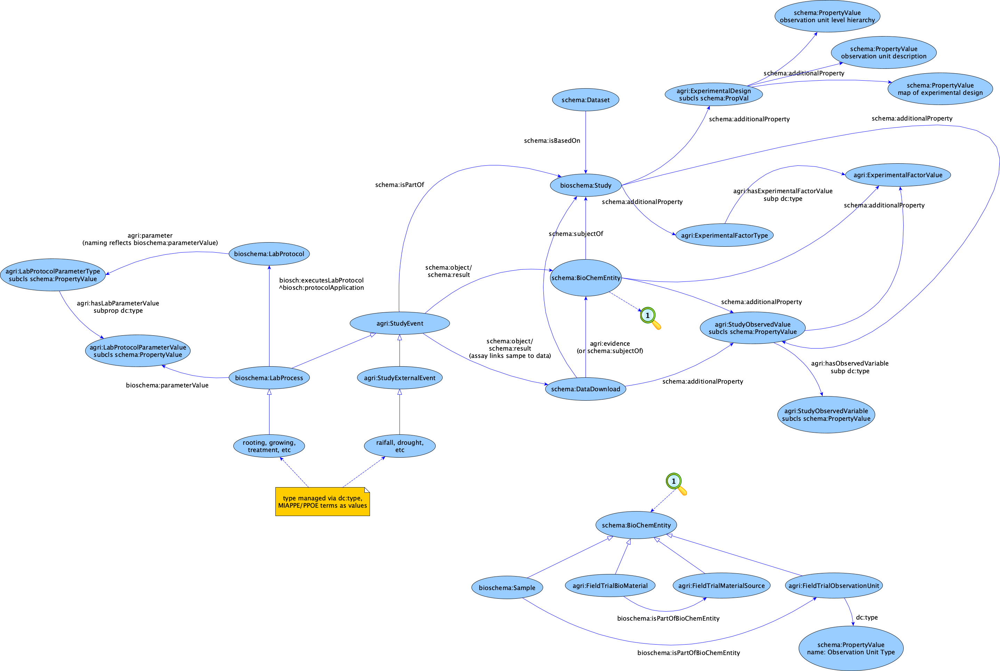

# Modelling MIAPPE

## General Notes
* Previously, MIAPPE has been mapped to ISA, and this is used in eg, 
  http://cropnet.pl/plantphenodb/. MIAPPE sections and fields were also mapped to
  the BrAPI specifications (see below)
* We took one of the examples that the MIAPPE paper mentions and re-mapped the 
  ISA-Tab attached to the paper into bioschema.org, schema.org and (possibly new) AgriSchemas types.
  Details [here](dataset-arabidopsis).
* Most of the work has been done with the the ELIXIR Plant Biology community. A summary of [the mapping we agreed is here](MIAPPE-multiple-mappings.xlsx).

* Some MIAPPE docs:
  * [MIAPPE Diagram](https://github.com/MIAPPE/MIAPPE/tree/master/MIAPPE_Checklist-Data-Model-v1.1)
  * [MIAPPE checklist](https://github.com/MIAPPE/MIAPPE/blob/master/MIAPPE_Checklist-Data-Model-v1.1/MIAPPE_Checklist-Data-Model-v1.1.pdf)
  * [Mappings in ISA-Tab Phenotyping](https://github.com/MIAPPE/ISA-Tab-for-plant-phenotyping/blob/master/MIAPPE-ISATab%20mapping.pdf) 

## MIAPPE mapping, general approach

*click on the image for zooming-in*

* [A real use case here](dataset-arabidopsis), together with explanations about data modelling choices emerged during the plant biology collaboration.

*The figure is based on [yED](https://www.yworks.com/products/yed), original file [here](agrischema-miappe-modelling.graphmlz)*.
    
## Further material

* During the DFW 11/2019 hackathon, we compared AgriSchemas to [GLTen](https://www.glten.org), 
  [here](../../201911-dfw-hackathon/agrischemas-vs-glten.md). See also [Minimum Info for Long Term Experiments (MILAX)](https://github.com/GLTEN/MILAX).
