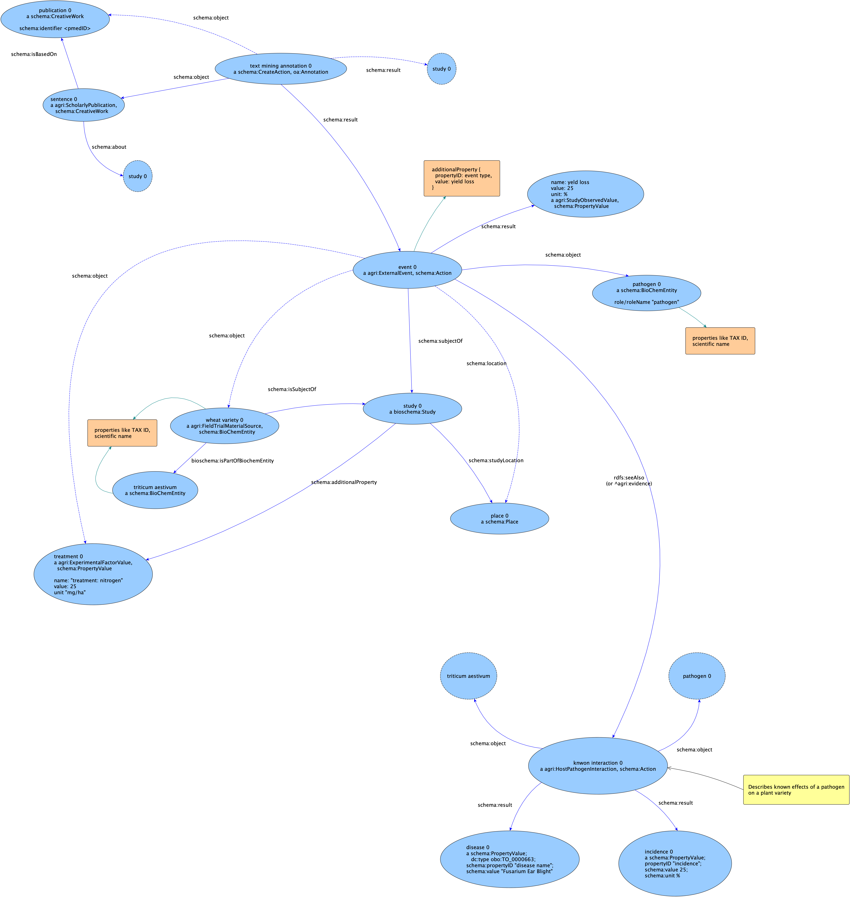

# Agrischema - Text Mining and Semantic Annotation Use Cases

These use cases are about text mining and semantic annotations. 

* A [basic example](text-mining-use-case.ttl)
* A real-world use case, regarding the GBCL/CABI project (TODO: references)
  * [diagram](gbcl-text-mining-use-case.png) ([original format](gbcl-text-mining-use-case.graphmlz), made with [yED](https://www.yworks.com/products/yed)). This is also shown below (click to open separately and zoom).
  * [Turtle example](gbcl-text-mining-use-case.ttl)

