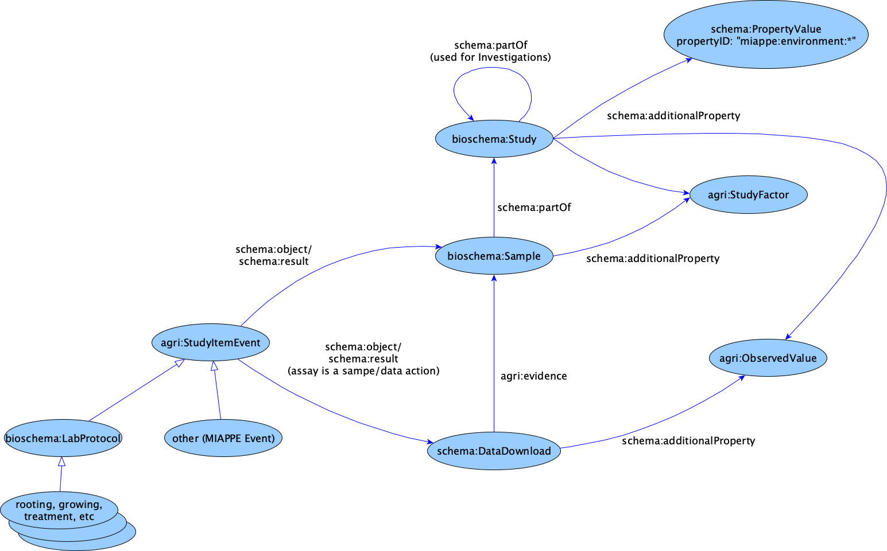

# Modelling MIAPPE

## General Notes
  * MIAPPE was mapped to ISA, and this is used in eg, http://cropnet.pl/plantphenodb/
    * We took *Wisniewska et al, 2017* from there as an example.
  * MIAPPE docs:
    * [MIAPPE Diagram](https://github.com/MIAPPE/MIAPPE/tree/master/MIAPPE_Checklist-Data-Model-v1.1)
    * [MIAPPE checklist](https://github.com/MIAPPE/MIAPPE/blob/master/MIAPPE_Checklist-Data-Model-v1.1/MIAPPE_Checklist-Data-Model-v1.1.pdf)
    * [Mappings in ISA-Tab Phenotyping](https://github.com/MIAPPE/ISA-Tab-for-plant-phenotyping/blob/master/MIAPPE-ISATab%20mapping.pdf) 

## Modelling in agrischemas
  * `bioschema:Study`, as in MIAPPE
    * an Investigation is an `bioschema:Study` with the investiation `schema:additionalType`, which points to other `bioschema:Study`(es), via `schema:hasPart`/`schema:isPartOf`
	* MIAPPE Environment Params are linked to `bioschema:Study` via `schema:additionalProperty` and they're identified by means of their ID (or `schema:additionalType`).
	* `agri:StudyFactor`(s) can be linked to each of studies, samples, data file, observed value.
  * `bioschema:Sample`, includes MIAPPE sample, ISA-Tab source. The latter includes MIAPPE biological material, observational unit values
  * Samples can be linked one each-other by a new class: `agri:StudyItemEvent`. This is a subclass of `schema:Action` and has `bioschema:LabProtocol` as subclass (which, might include MIAPPE subtypes like rooting, growth, treatement, etc.). Protocols have variables like watering, pesticide, etc. `StudyItemEvent` includes what MIAPPE calls 'event' (ie, non-planned events such as weather phenomena).
  * Samples can be linked to `schema:DataDownload`, which in turn can be linked to `schema:variableMeasured`. Target value is `agri:ObservedValue` (to be modelled).
    * an `agri:ObservedValue` can be `schema:additionalProperty` of Study
    * There isn't much need for assay. Could be an event like data collection from samples
  

Here it is a diagram (made with [yED](https://www.yworks.com/products/yed), 
original file [here](agrischema-miappe-modelling.graphmlz)):

** ==> [Use case](../miappe-use-case.ttl)*** from the model outlined above
